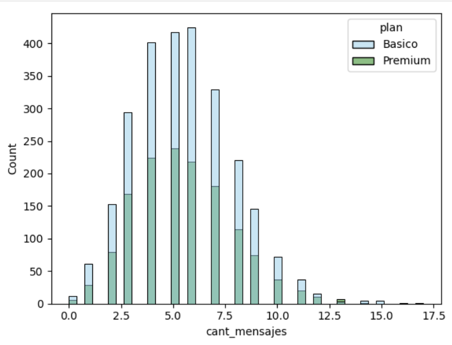
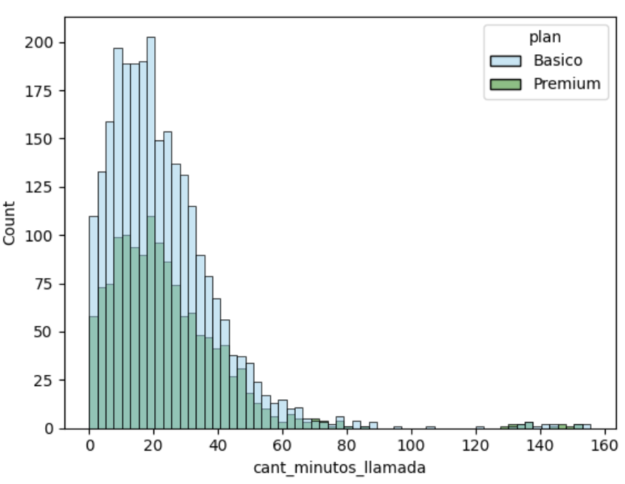
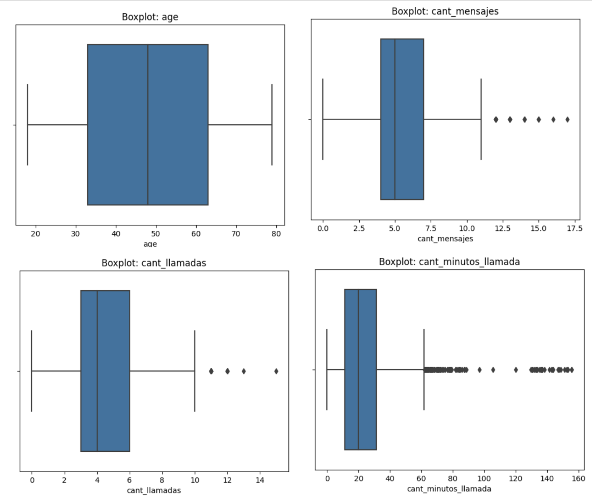

# 📊 ConnectaTel — Análisis Exploratorio de Datos

## 📌 Descripción
Análisis exploratorio de datos para ConnectaTel, empresa de telecomunicaciones latinoamericana. El proyecto identifica patrones de uso, detecta comportamientos atípicos y segmenta clientes para optimizar la oferta comercial y mejorar la experiencia del usuario.

**Herramientas:** Python · Pandas · NumPy · Seaborn · Matplotlib

---

## 🔍 Hallazgos Principales

### Calidad de datos
- Se detectaron y corrigieron sentinels en `age` (-999) y `city` ('?'), además de 40 fechas imposibles en `reg_date` (año 2026).
- Los nulos en `duration` y `length` se confirmaron como MNAR — dependen del tipo de evento (llamada o mensaje) y se mantuvieron.

### Segmentación de clientes
- **Por edad:** 50.44% Adultos, 30.56% Adultos Mayores, 19% Jóvenes.
- **Por nivel de uso:** 73.59% Uso medio, 19.45% Bajo uso, 6.95% Alto uso.
- Los Adultos Mayores (70-80 años) muestran mayor proporción de plan Premium, sugiriendo mayor capacidad económica.

### Patrones de uso
- Los usuarios Premium envían más mensajes y realizan más llamadas que los Básico.
- La duración de llamadas es similar entre ambos planes — el plan influye en frecuencia, no en duración.
- Se detectaron outliers del lado derecho en `cant_mensajes`, `cant_llamadas` y `cant_minutos_llamada`, representando usuarios de alto valor.

---

## 📈 Visualizaciones





---

## 💡 Recomendaciones
- Campaña de upgrade para usuarios Básico con alto volumen de uso, ofreciendo descuento en el primer mes de Premium.
- Promociones de fidelización para Adultos Mayores en plan Premium.
- Ofertas de datos adicionales para jóvenes en plan Básico para engancharlos a largo plazo.
- Programa de lealtad para usuarios outliers de alto consumo.
- Campañas de reactivación para usuarios de Bajo uso.

---

## 📂 Datasets
| Archivo | Descripción |
|---|---|
| `users_latam.csv` | Información demográfica y de plan de 4,000 usuarios |
| `usage.csv` | 40,000 registros de uso (llamadas y mensajes) |
| `plans.csv` | Descripción de los planes Básico y Premium |

---

## 🔍 Etapas del Análisis
1. **Exploración inicial** — estructura, tipos de datos y primeras observaciones
2. **Calidad de datos** — detección de nulos, sentinels y fechas imposibles
3. **Limpieza** — corrección de sentinels, imputación y marcado de fechas inválidas
4. **Agregación** — construcción de métricas de comportamiento por usuario
5. **Visualización** — histogramas y análisis por tipo de plan
6. **Outliers** — boxplots y cálculo de límites IQR
7. **Segmentación** — clasificación por edad y nivel de uso
8. **Insight ejecutivo** — conclusiones y recomendaciones para stakeholders

---

## ▶️ Cómo ejecutar

### Google Colab
[](https://colab.research.google.com/github/DebbieJara/connectatel-analysis/blob/main/Project_ConnectaTel.ipynb)

1. Haz clic en el badge de arriba
2. Ejecuta las celdas en orden — los datasets ya están en el repositorio

### Jupyter local
```bash
git clone https://github.com/DebbieJara/connectatel-analysis.git
pip install pandas numpy matplotlib seaborn
jupyter notebook
```

> Se recomienda ejecutar todas las celdas en orden desde el inicio.

---

## 👩‍💻 Autora
**Debbie Jara** · [GitHub](https://github.com/DebbieJara) · Data Analyst en formación
